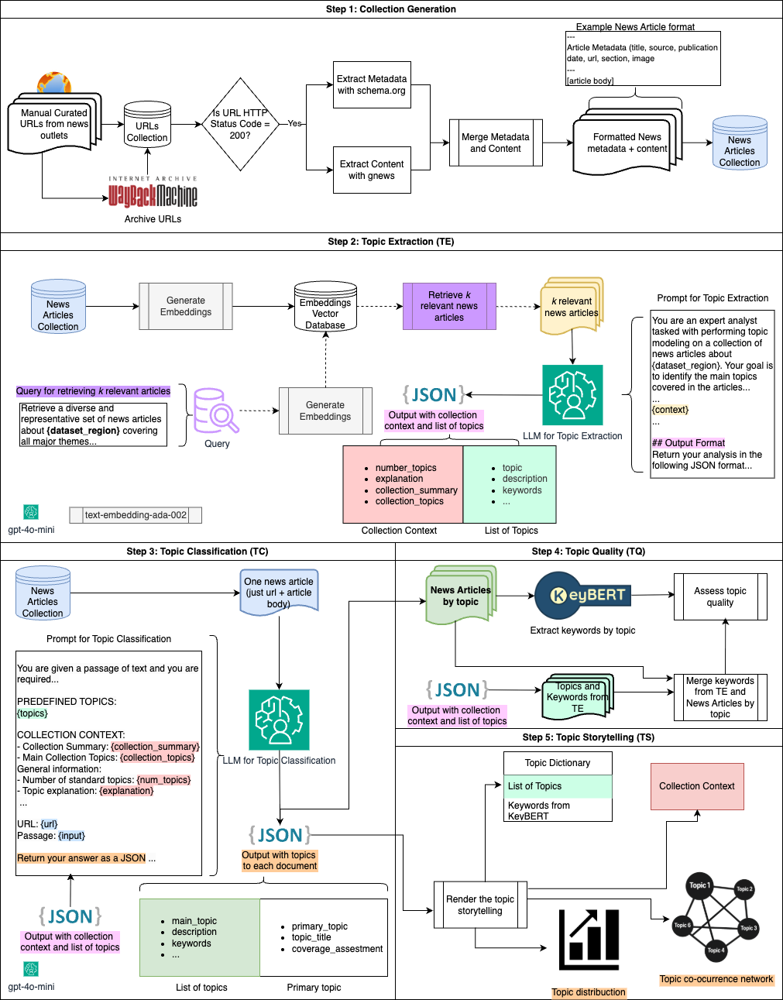

# RAG-TEC: Extracting and Classifying Topics in Digital News Collections Using LLMs

## Abstract

This repository implements RAG-TEC (Retrieval-Augmented Generation for Topic Extraction and Classification), a novel approach addressing redundancy and interpretability challenges in topic modeling of news corpora. RAG-TEC leverages Large Language Models (LLMs) with retrieval-augmented generation to improve unsupervised topic discovery. The framework demonstrates superior performance compared to traditional methods such as LDA, BERTopic, and the enhanced RAG-TEC+KeyBERT hybrid. Additionally, it produces rich storytelling outputs including Topic Dictionary, Collection Context, Topic Distribution, and Topic Co-occurrence Network, facilitating deeper insights into news collections.

## Research Objectives

- **Primary**: Introduce and evaluate RAG-TEC for unsupervised topic discovery in news collections  
- **Secondary**: Compare against LDA, BERTopic, and RAG-TEC+KeyBERT in coherence and diversity  
- **Application**: Case studies on four African crisis-related news collections

## Methodology Overview

The research methodology follows a systematic 5-stage pipeline:



### Collection Generation

Manually curate URLs from diverse news outlets (e.g., Reuters, DW), archive each page using the Internet Archive’s Wayback Machine to ensure persistence, and validate accessibility by checking for successful responses. For each valid URL, extract metadata (title, author, images) using schema.org standards and retrieve full-text content with tools such as Gnews Web Scraper. Implement random delays and retry logic to minimize blocking and maximize completeness. Merge metadata and content into a standardized document format, providing rich context for topic discovery via retrieval-augmented generation (RAG) systems.

### Topic Extraction

Retrieve representative subsets of the archived news collection using a retrieval query and vector database, then use an LLM (e.g., GPT-4o-mini) with a topic-extraction prompt (`prompts/topic_extraction_prompt.txt`) to extract structured topics and collection context. Embeddings are generated for all articles and stored for efficient retrieval. The optimal number of articles for extraction is determined by a heuristic balancing coverage and efficiency (see `prompts/docs_retrieve_query.txt`). The LLM produces a collection-level analysis, topic list, descriptions, keywords, and representative documents. All prompt and query templates are available in the repository.

### Topic Classification

Assign each article to one or more predefined topics identified in the extraction step, allowing for multi-topic assignments. The LLM receives the article’s URL and full text, guided by a topic-classification prompt (`prompts/topic_classification_prompt.txt`) that incorporates the topic list and collection context. The model identifies main and primary topics, generates supporting details, and can create new topics if needed, serving as a diagnostic for topic coverage. Implementation scripts and prompt templates are available in the repository.

### Topic Quality

Evaluate the quality of extracted topics using two complementary metrics: topic coherence (C_V) and topic diversity (Jaccard Diversity). Coherence is measured by the semantic relatedness of top keywords, while diversity quantifies vocabulary overlap between topics. Keywords are sourced both from the LLM (during extraction) and from KeyBERT applied to the entire collection. Implementation scripts and metric details are available in the repository (`utils/ragtec_topic_quality.py`, `code/6_metrics_document_ragtec.py`, `code/6_metrics_document_ragtec_keybert.py`).

### Topic Storytelling

Synthesize outputs from previous stages to provide a comprehensive, narrative-driven understanding of the collection. Generate four complementary views: Topic Dictionary (labels, descriptions, keywords), Collection Context (summary and main themes), Topic Distribution (primary/secondary appearances and importance ratio), and Topic Co-occurrence Network (visualizing topic relationships and overlaps). These outputs combine descriptive text, quantitative measures, and relational structures, supported by utility scripts for formatting and visualization. All implementation scripts and prompt templates are available in the repository.


## Repository Structure

```
ragtec/
├── code/                                    # Source code implementation
│   ├── 1_url-formatting.py                  # Format and extract URLs from source lists
│   ├── 1_schema-exctration.py               # Extract schema metadata from URLs
│   ├── 1_data.py                            # Scrape metadata and articles
│   ├── 2_gnews-content-scrapper.py          # Scrape news content from Gnews
│   ├── 2_news_extraction.py                 # News content extraction (legacy/alt)
│   ├── 3_news-formatting-document.py        # Format and merge articles for modeling
│   ├── 4_topic_modeling_ragtec.py           # RAGTEC implementation
│   ├── 4_topic_modeling_lda.py              # LDA baseline
│   ├── 4_topic_modeling_bertopic.py         # BERTopic baseline
│   ├── 5_topic_ragtec_classifcation.py      # RAGTEC topic classification
│   ├── 6_metrics_document_ragtec.py         # Topic quality metrics (LLM)
│   ├── 6_metrics_document_ragtec_keybert.py # Topic quality metrics (KeyBERT)
│   ├── 6_metrics_document_lda.py            # LDA metrics
│   ├── 6_metrics_document_bert.py           # BERT metrics
│   ├── 7_topic_storytelling_ragtec.py       # Storytelling and visualization
│   ├── combined_scraper.py                  # Combined scraping utilities
│   ├── simple_flatten.py                    # Data flattening utilities
│   ├── utils/                              # Core utility modules
│   │   ├── ragtec_topic_extraction.py      #   - RAGTEC extraction logic
│   │   ├── ragtec_topic_classification.py  #   - RAGTEC classification logic
│   │   ├── ragtec_topic_quality.py         #   - Quality assessment metrics
│   │   ├── ragtec_topic_quality_keybert.py #   - KeyBERT quality metrics
│   │   ├── ragtec_topic_storytelling.py    #   - Storytelling utilities
│   │   ├── news_extraction.py              #   - News scraping utilities
│   │   ├── scraping_utils.py               #   - Additional scraping utilities
│   │   └── optimal_k.py                    #   - Optimal k calculation
│   └── paper/                             # Research output scripts
├── data/                                  # Dataset storage
│   ├── burundi/                           # Burundi news corpus
│   ├── drc/                               # Democratic Republic of Congo corpus
│   ├── mozambique/                        # Mozambique news corpus
│   └── sudan/                             # Sudan news corpus
├── output/                                # Results and generated outputs
├── prompts/                               # LLM prompt templates
│   ├── topic_extraction_prompt.txt        # RAGTEC extraction prompts
│   ├── topic_extraction_prompt_original.txt # Original extraction prompts
│   ├── topic_classification_prompt.txt    # RAGTEC classification prompts
│   └── docs_retrieve_query.txt            # Retrieval query templates
├── image/                                 # Generated visualizations
└── requirements.txt                       # Dependencies specification
```

## Datasets

The research analyzes curated news collections from Mozambique, Burundi, Democratic Republic of Congo (DRC), and Sudan. These collections are archived via the Internet Archive’s Wayback Machine and focus on political, humanitarian, and climate crises in these regions. The datasets are formatted and processed to support comprehensive topic modeling analysis.

## Implementation Details

### Stage 1: Collection Generation
- URL collection and validation  
- Schema extraction from news sources  
- Multi-source aggregation  

### Stage 2: Topic Extraction (`4_topic_modeling_ragtec.py`)
- Context-aware topic discovery using retrieval-augmented LLMs  
- Redundancy reduction and interpretability enhancements  

### Stage 3: Topic Classification (`5_topic_ragtec_classifcation.py`)
- Multi-topic assignment per document  
- Confidence scoring and classification logic  

### Stage 4: Topic Quality (`6_metrics_document_ragtec.py`, `6_metrics_document_ragtec_keybert.py`)
- Coherence and diversity tradeoff evaluation
- Additional metrics available for baseline comparisons (`6_metrics_document_lda.py`, `6_metrics_document_bert.py`)  


### Stage 5: Topic Storytelling (`7_topic_storytelling_ragtec.py`)
- Generation of Topic Dictionary, Collection Context, Topic Distribution, and Topic Co-occurrence Network  

## Installation and Setup

### Environment Requirements

- **Python**: 3.11
- **Primary Dependencies**: gensim==4.3.3, numpy==1.26.4, scipy==1.13.1  

### Installation Steps

1. **Create conda environment**:
```bash
conda create -n ragtec python=3.11 -y
conda activate ragtec
```

2. **Install dependencies**:
```bash
pip install -r requirements.txt
```

3. **Verify installation**:
```bash
python -c "from gensim.models.coherencemodel import CoherenceModel; print('Installation successful!')"
```

**Note**: If you encounter timeout errors during installation, try:
```bash
pip install -r requirements.txt --timeout 1000
# or install key packages individually:
pip install gensim==4.3.3 numpy==1.26.4 scipy==1.13.1
```

### Environment Variables

Create a `.env` file with required API keys:
```bash
# OpenAI API key for RAGTEC implementation
OPENAI_API_KEY=your_openai_key_here

# Additional API keys as needed
```

## Usage Instructions

### Complete Pipeline Execution

Run the full RAGTEC pipeline for a specific dataset:

```bash
conda activate ragtec
cd code

# Example: Process DRC dataset
# Note: Most scripts require manual configuration of dataset_name variable within the script

# Step 1: URL formatting and extraction
python 1_url-formatting.py                     # Configure dataset_name in script

# Step 2: Schema extraction and data scraping  
python 1_schema-exctration.py                  # Configure dataset_name in script
python 1_data.py --dataset drc                 # Has CLI support
# OR use combined scraper:
python combined_scraper.py --dataset drc --mode both

# Step 3: Content scraping and formatting
python 2_gnews-content-scrapper.py             # Configure dataset_name in script
python 3_news-formatting-document.py           # Configure dataset_name in script

# Step 4: Topic modeling
python 4_topic_modeling_ragtec.py              # Configure dataset_name in script

# Step 5: Topic classification  
python 5_topic_ragtec_classifcation.py         # Configure dataset_name in script

# Step 6: Metrics calculation
python 6_metrics_document_ragtec.py            # Configure dataset_name in script
python 6_metrics_document_ragtec_keybert.py    # Configure dataset_name in script

# Step 7: Storytelling and visualization
python 7_topic_storytelling_ragtec.py          # Configure dataset_name in script
```

### Individual Component Usage

**RAGTEC Topic Extraction** (configure dataset_name in script):
```bash
python 4_topic_modeling_ragtec.py
```

**Topic Classification** (configure dataset_name in script):
```bash  
python 5_topic_ragtec_classifcation.py
```

**Metrics Calculation** (configure dataset_name in script):
```bash
python 6_metrics_document_ragtec.py
```

**Combined Scraper** (has CLI support):
```bash
python combined_scraper.py --dataset mozambique --mode both
python combined_scraper.py --dataset sudan --mode schema  
python combined_scraper.py --dataset drc --mode articles
```

**Baseline Comparisons** (configure dataset_name in script):
```bash
python 4_topic_modeling_lda.py      # LDA baseline
python 4_topic_modeling_bertopic.py # BERTopic baseline
```

## Evaluation Metrics

The framework focuses on evaluating topic coherence (CV) and diversity (Jaccard Diversity), emphasizing the tradeoff between these metrics. While KeyBERT integration improves coherence scores, it slightly reduces topic diversity, highlighting the balance required for optimal topic quality.

## Results and Outputs

Results are organized by dataset and method, aligned with the storytelling stage outputs:
```
output/
├── {dataset}/
│   ├── ragtec/
│   │   ├── extraction/     # Topic extraction results
│   │   ├── classification/ # Classification outputs  
│   │   └── quality/        # Evaluation metrics
│   ├── lda/               # LDA baseline results
│   └── bertopic/          # BERTopic baseline results
```

Storytelling outputs include Topic Dictionary, Collection Context, Topic Distribution, and Topic Co-occurrence Network to facilitate comprehensive understanding.

## Contributing

For research collaboration or technical contributions:

1. Fork the repository  
2. Create feature branches for specific improvements  
3. Ensure all tests pass and code follows project standards  
4. Submit pull requests with detailed descriptions  

## License

This project is licensed under the MIT License - see the [LICENSE](LICENSE) file for details.

## Contact

For questions regarding this research or collaboration opportunities, please contact [research team contact information].

---

**Keywords**: Topic Modeling, Retrieval-Augmented Generation, Large Language Models, News Analysis, Computational Journalism, Conflict Analysis
